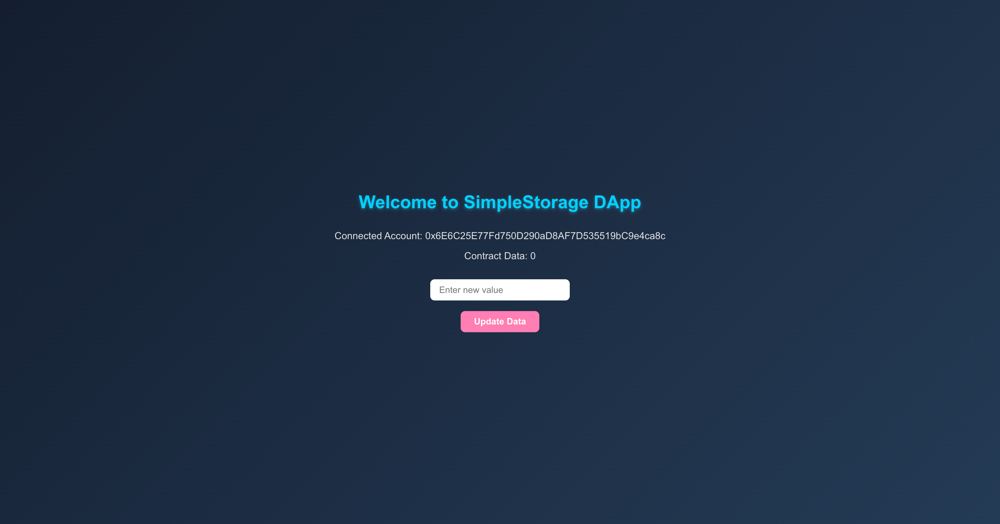

# SimpleStorage DApp

Welcome to **SimpleStorage DApp**, a decentralized application (DApp) built using **React**, **Truffle**, **Ganache**, **Web3.js**, and **Solidity**. This project demonstrates how to store and retrieve data from a smart contract on a local Ethereum blockchain.

---

## 🛠 Tech Stack / Languages Used

**Frontend**
- React.js – UI for interacting with smart contracts
- JavaScript (ES6+) – Programming language for frontend logic
- CSS – Styling components

**Blockchain / Backend**
- Solidity – Smart contract language
- Truffle – Development framework for Ethereum
- Ganache – Local Ethereum blockchain for testing
- Web3.js – Connect frontend to Ethereum blockchain

**Tools**
- Node.js / NPM – JavaScript runtime and package manager
- Create React App – Frontend boilerplate
- Moralis (optional) – Backend APIs for Web3 applications

---

## 📂 Project Structure

TruffleReactDemo/
├── contracts/                  # Solidity smart contracts
│   ├── SimpleStorage.sol
│   └── SWK.sol
├── migrations/                 # Deployment scripts
│   ├── 1_initial_migration.js
│   ├── 2_deploy_simplestorage.js
│   └── 3_deploy_swk.js
├── build/                      # Compiled contract artifacts
├── scripts/                    # Custom scripts for deploying contracts
├── truffle-config.js           # Truffle configuration
frontend/
├── src/
│   ├── App.js                  # React main component
│   ├── contracts/              # Compiled contract JSON files
│   └── App.css                 # Styling
package.json                     # Project dependencies

---

## ⚡ Getting Started

### 1. Install dependencies

```bash
npm install

2. Start Ganache (local blockchain)
npm run devchain


Ganache CLI or GUI should run on port 7545 (default)

Absolutely! I can take your version and merge it with the structured, detailed README style from before. Here's a polished and fully structured README.md for your **SimpleStorage DApp** project:

---

# SimpleStorage DApp

Welcome to **SimpleStorage DApp**, a decentralized application (DApp) built using **React**, **Truffle**, **Ganache**, **Web3.js**, and **Solidity**. This project demonstrates how to store and retrieve data from a smart contract on a local Ethereum blockchain.

---

## 🛠 Tech Stack / Languages Used

**Frontend**

* React.js – UI for interacting with smart contracts
* JavaScript (ES6+) – Programming language for frontend logic
* CSS – Styling components

**Blockchain / Backend**

* Solidity – Smart contract language
* Truffle – Development framework for Ethereum
* Ganache – Local Ethereum blockchain for testing
* Web3.js – Connect frontend to Ethereum blockchain

**Tools**

* Node.js / NPM – JavaScript runtime and package manager
* Create React App – Frontend boilerplate
* Moralis (optional) – Backend APIs for Web3 applications

---

## 📂 Project Structure

```
TruffleReactDemo/
├── contracts/                  # Solidity smart contracts
│   ├── SimpleStorage.sol
│   └── SWK.sol
├── migrations/                 # Deployment scripts
│   ├── 1_initial_migration.js
│   ├── 2_deploy_simplestorage.js
│   └── 3_deploy_swk.js
├── build/                      # Compiled contract artifacts
├── scripts/                    # Custom scripts for deploying contracts
├── truffle-config.js           # Truffle configuration
frontend/
├── src/
│   ├── App.js                  # React main component
│   ├── contracts/              # Compiled contract JSON files
│   └── App.css                 # Styling
package.json                     # Project dependencies
```

---
Perfect! Here's the updated README with a **“Common Issues & Troubleshooting”** section added at the bottom:

---

# SimpleStorage DApp

Welcome to **SimpleStorage DApp**, a decentralized application (DApp) built using **React**, **Truffle**, **Ganache**, **Web3.js**, and **Solidity**. This project demonstrates how to store and retrieve data from a smart contract on a local Ethereum blockchain.

---

## 🛠 Tech Stack / Languages Used

**Frontend**

* React.js – UI for interacting with smart contracts
* JavaScript (ES6+) – Programming language for frontend logic
* CSS – Styling components

**Blockchain / Backend**

* Solidity – Smart contract language
* Truffle – Development framework for Ethereum
* Ganache – Local Ethereum blockchain for testing
* Web3.js – Connect frontend to Ethereum blockchain

**Tools**

* Node.js / NPM – JavaScript runtime and package manager
* Create React App – Frontend boilerplate
* Moralis (optional) – Backend APIs for Web3 applications

---

## 📂 Project Structure

```
TruffleReactBlockchainDemo/
├── contracts/              # Solidity smart contracts
│   ├── SimpleStorage.sol
│   └── SWK.sol
├── migrations/             # Deployment scripts
│   ├── 1_initial_migration.js
│   ├── 2_deploy_simplestorage.js
│   └── 3_deploy_swk.js
├── build/                  # Compiled contract artifacts
├── scripts/                # Custom scripts for deploying contracts
├── truffle-config.js       # Truffle configuration
├── frontend/
│   ├── package.json
│   ├── public/
│   │   └── index.html
│   └── src/
│       ├── App.js          # React main component
│       ├── App.css         # Styling
│       └── contracts/      # JSON files of compiled contracts (optional)
├── package.json            # Root package.json for Truffle
└── .gitignore

```

---

## ⚡ Getting Started

### 1. Install dependencies

```bash
npm install
cd frontend
npm install
```

### 2. Start Ganache (local blockchain)

> Ganache CLI or GUI should run on port `7545` (default). Ensure no other service is using the port.

### 3. Compile smart contracts

```bash
truffle compile
```

### 4. Deploy smart contracts

```bash
truffle migrate --reset --network development
```

### 5. Start the React frontend

```bash
npm run start-frontend
```

> Open [http://localhost:3000](http://localhost:3000) to view the DApp.

---

## 🚀 How It Works

1. The **SimpleStorage** contract allows you to store and retrieve a single number on the blockchain.
2. The React frontend connects to the blockchain using **Web3.js**.
3. Users can input a value and submit it, which updates the contract state.
4. The DApp reads the latest stored value and displays it dynamically.

---

## 🔧 Truffle Commands

| Command                                         | Description                            |
| ----------------------------------------------- | -------------------------------------- |
| `truffle init`                                  | Initialize a new Truffle project       |
| `truffle compile`                               | Compile Solidity contracts             |
| `truffle migrate --reset`                       | Deploy contracts to local blockchain   |
| `truffle migrate --reset --network development` | Deploy to a specific network (Ganache) |

---

## 🖥 Ganache Overview

[Ganache](https://www.trufflesuite.com/ganache) is a personal blockchain for Ethereum and Filecoin development. It allows you to:

* Deploy contracts safely
* Test transactions in a deterministic environment
* View accounts, balances, and logs in real-time

**Versions:**

* **Ganache UI** – Desktop application with GUI
* **Ganache CLI** – Command-line version for automation

---

## 💻 React Frontend

The React app:

* Connects to the smart contract via **Web3.js**
* Reads and writes data to the blockchain
* Dynamically updates UI with contract data

**Key Files:**

* `frontend/src/App.js` – Main application logic
* `frontend/src/contracts/SimpleStorage.json` – Contract ABI and network info

---

## 📚 Learn More

* [Truffle Documentation](https://trufflesuite.com/docs/truffle/)
* [Ganache Documentation](https://www.trufflesuite.com/docs/ganache/overview)
* [React Documentation](https://reactjs.org/docs/getting-started.html)
* [Web3.js Documentation](https://web3js.readthedocs.io/)

---

## ⚙ Optional Scripts

You can automate compilation, deployment, and frontend launch by adding this in `package.json`:

```json
"scripts": {
   "install-all": "npm install && cd frontend && npm install",
    "compile-contracts": "truffle compile",
    "migrate-contracts": "truffle migrate --reset --network development",
    "start-frontend": "cd frontend && react-scripts start",
    "deploy-and-start": "npm run install-all && npm run compile-contracts && npm run migrate-contracts && npm run start-frontend"
}
```

Now, running:

```bash
npm run deploy-and-start
```

Will compile contracts, deploy to Ganache, and start the frontend automatically.

---

## ⚠ Common Issues & Troubleshooting

1. **Ganache connection error**

   * Ensure Ganache is running on port `7545` or  You can start Ganache CLI with:  npx ganache --port 7545
   * Update `truffle-config.js` and frontend Web3 provider if using a different port.

2. **Deployment failure / invalid opcode**

   * Check your Solidity contract code for constructor issues.
   * Ensure you're using the correct compiler version in `truffle-config.js`.

3. **React frontend cannot connect**

   * Make sure the contract address in `SimpleStorage.json` matches the deployed network.
   * Ensure Web3 provider URL matches Ganache network.

4. **Port conflicts**

   * If Ganache or React fails to start, another process may be using the same port. Kill conflicting processes or change the port.

5. **NPM package issues**

   * Run `npm install` or `npm ci` to ensure all dependencies are installed.
   * Delete `node_modules` and `package-lock.json` and reinstall if issues persist.

---
